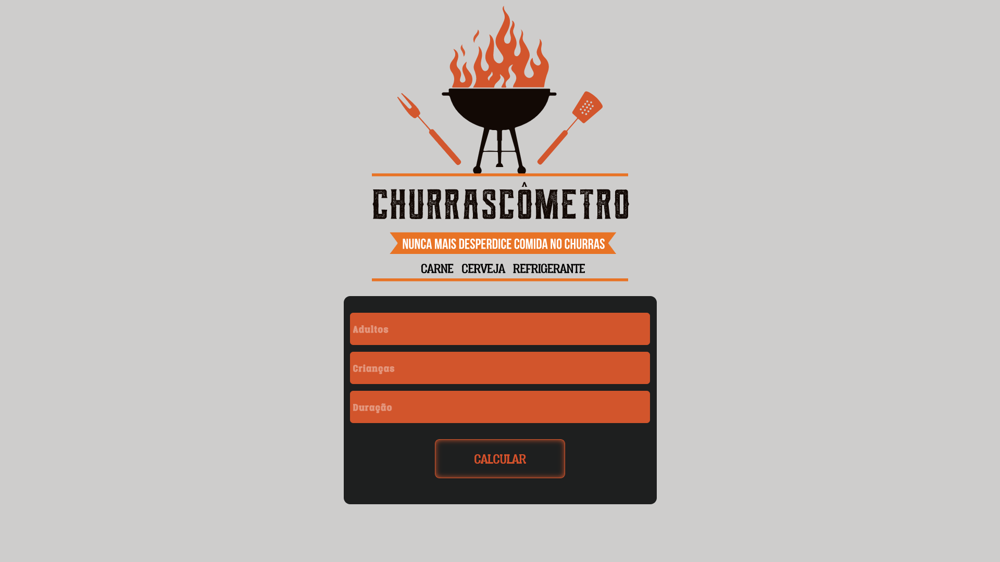

# Churrascometro-test
Desenvolvi o Churrascômetro usando javascript. Um site onde é possível calcular a quantidade de bebidas, cervejas e carne por pessoa.

## Churrascômetro-js

Desenvolvi o Churrascômetro usando javascript. Um site onde é possível calcular a quantidade de bebidas, cervejas e carne por pessoa. Fazendo o calculo é possível economizar na comida e no dinheiro gasto! Churrascômetro possui 3 campos, sendo eles: Número de adultos, Número de Crianças e duração da Atividade.

  

  
<strong>Abaixo você pode ver a interface:</strong>

  

  
  
<strong>Em outra imagem mostrando o resultado do cálculo:</strong>

  

